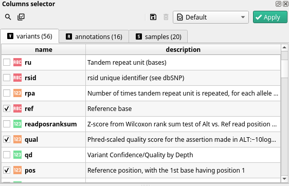

Selecting the fields you want to work with is the first step in cutevariant once the project is opened.

Every field you select will appear in the variant view as a single column.

## Field categories

One field in cutevariant represents one column in the variant view. But due to the structure of variant information, fields fall into three categories.

### Variants
Fields in this category contain information about the variant itself. It corresponds to the first columns in the VCF file. In these fields you will find information to identify the variant, such as its
position (starting at 1), the chromosome,the reference and alternative base, the quality and all data from INFO fields.

!!! note
    Multi allelic variant are split into different variants. For instance : 
    A>T,C becomes A>T and A>C. 

### Annotations

One gene can have several transcripts, each one having its own annotations. This information comes from the VCF file annotated with [SnpEff](https://pcingola.github.io/SnpEff/) or [VEP](https://www.ensembl.org/info/docs/tools/vep/index.html) following the [VCF annotation standard format](https://pcingola.github.io/SnpEff/adds/VCFannotationformat_v1.0.pdf). It corresponds to the ANN/EFF field in the VCF files. 

!!! tip
    If you want to know if a variant has several annotations associated with it, you can do so by checking, in the variants category, a field called `annotation_count`

!!! info
    As shown in the above screenshot, the field names are not prefixed with ann. However, when working with filters you have to keep in mind that every field you see in this category is called `ann.field_name`

### Samples

With every variant comes the set of samples in which it was found upon sequencing. One of the most widely used information about each sample is its genotype (field called `samples.charles.gt`) where `charles` is the name of the sample:

- unknown, when the locus was not found in this sample(:material-circle-off-outline:)
- homozygous for ref (:material-circle-outline:)
- heterozygous (:material-circle-half-full:)
- homozygous for alt (:material-circle:)

However, genotype is not the only field you can find in the samples category.
You can also find, depending on the VCF generation, allele sequencing depth or allele frequency.

