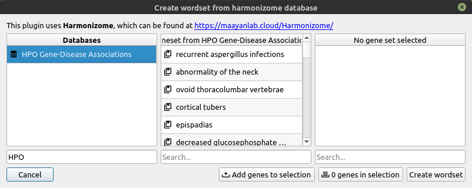
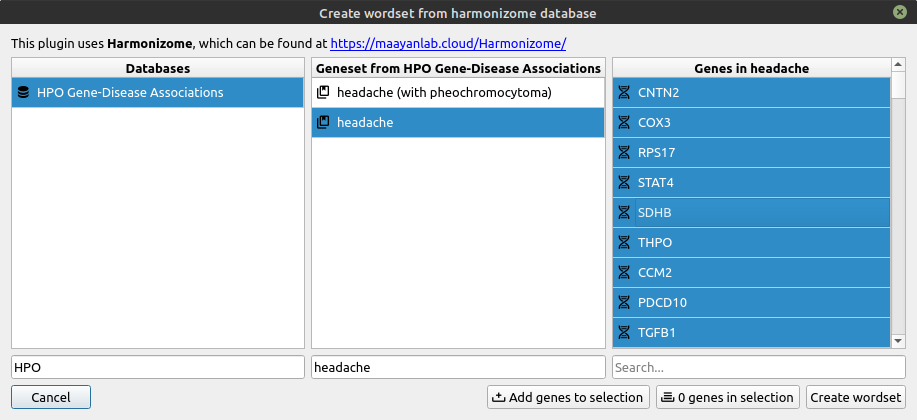
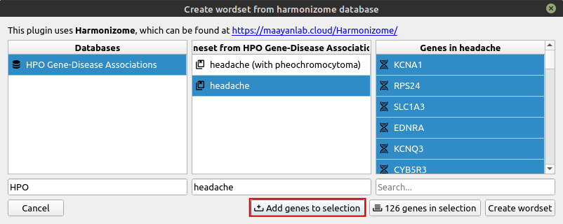

# Why use wordsets?

In Cutevariant, wordsets are named collections of text data. They are useful in filter requests, either in the 'WHERE' part of a [VQL statement](../vql) or in the [filters editor](/filters). Text fields such as ann.gene or ann.consequence(:material-alpha-s-box: in the fields editor), can be tested against wordsets.

For instance, if you are looking for variants in a specific gene set, then all you need is to create a wordset containing the names of all the genes you are intersted in, and selecting variants where the ann.gene field matches one of the genes in the wordset.

# Wordset plugin

Wordsets, just like every other feature in cutevariant, are stored in the project file (a sqlite3 database as explained [here]()).

The wordset plugin is where you can organize all the wordsets you defined for your project. It should look something like that:

As you can see, wordsets can be added (:material-plus:), edited (:material-file-edit:) and deleted (:material-trash-can-outline:).

When adding or editing a wordset, a dialog will popup so you can manually edit data in the wordset.

However, we now that manual editing can be tedious, and this is why the plugin comes with an 'import from file' feature. You can either find it in the wordset editing dialog (this will prompt you for a text file), or you can directly drag and drop the file from your desktop. In the latter case, the wordset will be named according to the file that you've dropped.

!!! note
    Whether you import the file from the dialog or from a drag and drop, the input file should contain one word per line with no space (lines with space will be ignored!)

# Set operations

Now that we've covered the basics of wordsets, let's go deeper and see how to create wordsets from boolean operations.

As a general idea, these operations allow you to create new sets from any number of existing ones. Here is how in detail.

## Union

This is the operation you need if you need to join two or more wordsets. It's basically an 'add' operation between every selected wordset.
To apply a union operation, just select every wordset you'd like to perform the union of, and press the :material-set-all: button.

This will prompt you for a new wordset name.

!!! note
    The number of resulting words in the newly created wordset might be less than the sum of the word counts in the starting sets. This is because of the unicity of elements in a set: there will be no doubles. See [wikipedia](https://en.wikipedia.org/wiki/Union_(set_theory)){target=_blank} for more info.

## Intersection

As the name suggests, the intersection will give you elements that are present in all selected wordsets.
To apply an intersection operation, just select every wordset you'd like to perform the intersection of, and press the :material-set-center: button.

Just like the union operation, it will prompt you for a new wordset name.

!!! note
    If you select many wordsets to intersect, they are more likely to give you an empty set.
    See [wikipedia](https://en.wikipedia.org/wiki/Intersection_(set_theory)){target=_blank} for more info.

## Difference

This one is a bit more tricky than the other two. In fact, while union and intersection operations are commutative, this one is not.
This means that A\B ≠ B\A. However, the operation A\B\C\D is equivalent to A \ ( B ∪ C ∪ D ). So in our case, the only thing that matters is that you select the right wordset as first operand.

To put it in practice, let's say you need a new wordset with elements from A that are neither in B, nor in C, nor in D.
In such case, you would select A first, all the other ones in any order, and press the :material-set-left: button.

See [wikipedia](https://en.wikipedia.org/wiki/Complement_(set_theory)#Relative_complement){target=_blank} for more information about this operation.

# Harmonizome tutorial

Here is an example of how you can generate a wordset, using the harmonizome plugin.

In this example, let's assume you have an exome at your disposal, and that you know what the patient suffers from.

[Harmonizome]((https://maayanlab.cloud/Harmonizome/)) is a great database that references, to date, 114 gene ontology databases. Among them, Reactome pathways, HPO gene-disease association or KEGG pathways just to name a few. These databases all provide association between an 'attribute' and a gene name (see the [about](https://maayanlab.cloud/Harmonizome/about) page on harmonizome website). This makes it very useful to reliably create gene sets, making sure that you always get gene names for the attributes you are looking for.

## Step 1 - Find the symptoms in HPO database

Let's say your patient has headache. Open up the harmonizome plugin (Tools/Create wordset from harmonizome database...), and search for 'HPO' in the dataset searchbar.

Now, if you type in 'headache' in the second searchbar, it will look for the name of the symptom.

!!! note
    This is only true for HPO, gene-disease association. Other databases refer to gene sets using their own toponymy.

Now that you've searched for 'headache', you will end up with several list items with the complete name of the symptom. If you click on one of them, you will find another list view with the list of genes associated with the symptom, according to HPO database.

## Step 2 - Select the genes from the resulting set

In the previous step, we just saw how you can search for a gene ontology database, then selecting a gene set according to the phenotype you observe in your sample. In this step, we will guide you through the generation of the wordset itself, using the harmonizome plugin.

As you can see below, you can select all the genes you wish in the rightmost view, using <kbd>Ctrl</kbd> + <kbd>A</kbd>.

With those genes selected, you can add them to the selection using the button as shown below.

Once you've added the genes to the selection, you can repeat any of the previous steps, as many times as you may need. For example, you may want to select another geneset from the same database, or even choose from another dataset.

!!! note
    Every time you add genes to the set, if the same gene is already in the selection, it will not be added (there are no doubles)

Now, when you're happy with your selection, you can create a wordset that will contain every gene in the selection, by pressing the button as shown below.

This will open a simple text prompt so that you can name the wordset as you like.

You're done! What you can do next is use the generated wordset as indicated here and here.

# General remarks

## Drag and drop

Cutevariant comes with some drag and drop features between its plugins. Concerning the wordset plugin, this means you can drag the wordset name from the list, and drop it to a condition in the [filters editor](/filters). If the condition is already set with a field, dropping a wordset on it will automatically fill the condition with the 'IN WORDSET' operator (using the dropped wordset as the value).
Otherwise, if you drop the wordset to a logical field (AND or OR), then it will create a condition on the ann.gene field and testing 'ann.gene IN WORDSET['{wordset name}'].