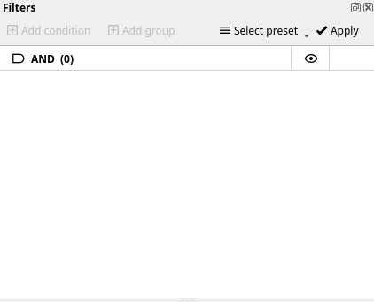

# Using filters

Filters in cutevariant are a handy way of getting rid of variants you may not be interested in.

As with any other feature un cutevariant, there is always two ways to do it. Through VQL or using the Filters plugin.

## Filtering with VQL

To apply a filter on a VQL request, first add the `WHERE` keyword at the end of the query. For instance,

`SELECT chr,pos,ref,alt FROM variants WHERE pos >= 10000`

will filter out every variant with position smaller than 10000.
The `WHERE` VQL statement supports two logical operators, `AND` and `OR`.

>
- You can use as many parenthesis as needed to separate the statements.
- Other operators that apply to the field depend on their type.

Currently, cutevariant supports 4 data types:
- Strings
- Integers
- Decimal numbers
- Booleans

### String operators

The simplest operators on strings are `=` and `!=`, respectively equality and inequality operators.
They apply on string fields, and there must be a perfect match between the field's value and the right hand side value.
However, most of the time you don't know the exact name of the gene you're looking for beforehand.
For instance, you may be looking for variants involving a whole gene family, or a known biological pathway. In this case, you need more data to match the field against, and therefore, more complex operators.

Luckily enough, there are three ways to address these types of issues.

#### Using regular expressions

First, you can use regular expressions. In cutevariant, we use python regular expressions engine under the hood, so [here](https://docs.python.org/3/library/re.html#regular-expression-syntax){target=_blank} is a great reference to get you started with this syntax.

#### Using wordsets

You can also define wordsets. These can contain any arbitrary number of strings, and can be loaded from a file.

Usage example:
`SELECT chr,pos,ref,alt,ann.gene FROM variants WHERE ann.gene IN WORDSET['My wordset']`

This will select every variant for which the gene annotation is in the wordset `My wordset`. Note the use of the `IN` operator, that can be negated with `NOT IN`.
To keep track of existing wordsets, create new ones, and modify them, there is a wordset plugin, which usage is described [here](wordset.md).

#### Using string lists

Last but not least, you can use string lists. This is an intermediate solution between equality/inequality operators, where you specify the exact match, and the wordset operators where you can have very long list of strings to match against.

Let's say you have a few gene names that you want to look for, then this is the perfect use case for string list matching.
In VQL, this translates into :

`SELECT chr,pos,ref,alt,ann.gene FROM variants WHERE ann.gene IN ('gene A','gene B','gene C')`

You can specify as many values as you want, as long as you quote the reference strings, separate values with commas, and put the whole test expression between parenthesis.

Note though, that if you have too many strings to test against one field, you may end up cluttering the VQL expression and make it hard to read.

If you need to make really complex operations, you can break them down by creating new [sources](selections.md), *a.k.a.* selections.

### Number operators

You can use any comparison operator on number, the only limitation is that you need to apply them one at the time.
For instance, the following VQL statement is not valid:

`SELECT chr,pos,ref,alt FROM variants WHERE 1000 < pos < 3000`

Instead, you need to use logical operators (such as `AND` and `OR`). So here is one possible fix for the above statement:

`SELECT chr,pos,ref,alt FROM variants WHERE pos > 1000 AND pos < 3000`

### Boolean operators

Some fields are booleans. As of 2021.05.08 release, you still need a comparison operator with them, such as `=`/`!=` and compare against True/False or 1/0.

For instance, this command is not valid:

`SELECT chr,pos,ref,alt FROM variants WHERE favorite`

Where this is one possible fix:

`SELECT chr,pos,ref,alt FROM variants WHERE favorite=True`

Allowed boolean values are:
- `True`, `true`, or `1`
- `False`, `false`, or `0`

Please keep in mind that these are case sensitive, which means that TRUE won't evaluate to true, and so on.

## Filtering using the Filters editor plugin

To make filtering easier if you don't want to type in complex VQL statements, we provided you with a tree-based filter editor.

First, if you don't see the filters editor plugin, this may be because it's hidden. To show it, toggle its visibility in the top toolbar, you can see it with the :material-filter: icon.

This is what the window should look like now:

Once you have the plugin opened, you will see a tree view with only one root item. This item represents the root of the filter, which means that everything you will add as child items will be chained with `AND` statements. Among these child statements, you can in turn add `OR` or `AND` statements.

If you'd like to change any `AND` statement into an `OR`, you can do this by simply double-cliking the item and selecting the logical operator.

Once you're happy with the filter you just set, you can simply hit the <kbd>:material-check:Apply</kbd> button on the right.

If you'd like to set the filter as a preset, you can do so by pressing <kbd>Save as preset</kbd> in the dropdown menu of the plugin.
